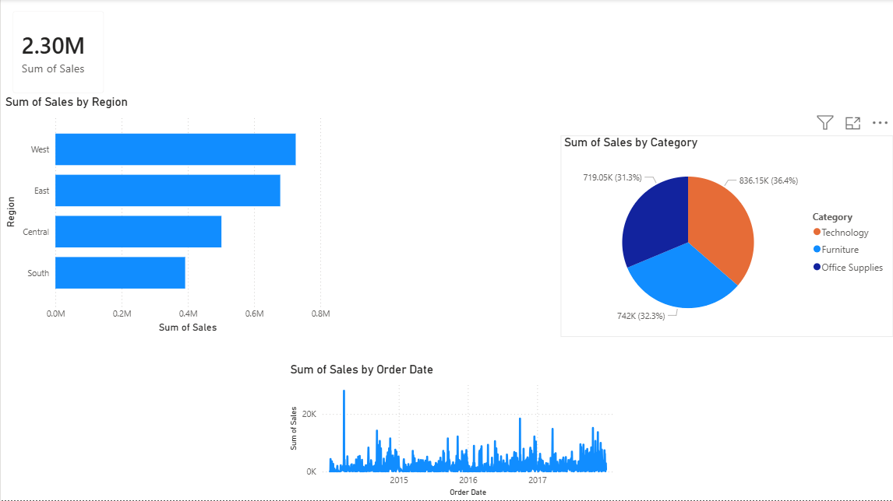

# Sales Dashboard using Power BI

## Objective
Analyze sales performance using interactive Power BI dashboards.

## Tools Used
- Power BI
- Data Visualization
- Dashboard Design

## Dashboard Features
- Total Sales KPI
- Sales by Region
- Sales by Category
- Sales Trend Analysis

## Key Learning
Built interactive dashboards and transformed raw sales data into business insights.

## Dashboard Preview

